# Akashic Records

An open-source, cross-platform novel reader built to offer a rich and customizable reading experience. Inspired by the mystical concept of the Akashic Records, the app organizes and presents knowledge in a user-friendly way — accessible anytime, anywhere.

  
  
  
  
  
  

> Join our community on [Discord](https://discord.gg/eSuc2znz5V)

---

## 📖 Description

**Akashic Records** is a mobile application for reading and managing digital novels. It supports offline usage, customizable themes, content sourcing from multiple web platforms (including scraping), and tools to personalize your reading journey. Designed with accessibility and flexibility in mind, it aims to make digital reading enjoyable for all.

---

## ✨ Features

- **Offline Mode** – Read without an internet connection using local storage.
- **Content Sourcing** – Fetch data from various web sources (scrapers included).
- **Favorites & History** – Save and track your favorite novels and your reading progress.
- **Reader Customization**
  - Adjust font size, line spacing, alignment, and themes
  - Switch between day/night modes
  - Supports different formats like HTML & Markdown

---

## 🛠️ Roadmap

### Features & Functionality

- [ ] Advanced search (filters, keywords, dates)
- [ ] Content filtering and browsing enhancements
- [x] Markdown/HTML format support
- [ ] Text-to-speech
- [x] Night mode and additional themes
- [ ] Page turning animation options

### Content & Management

- [ ] User-created notebooks or collections
- [ ] Tag-based categorization system

### User Experience

- [ ] UI/UX refinements
- [ ] Onboarding for new users
- [ ] User feedback/report system
- [ ] Notifications for updates and new chapters

### Performance & Storage

- [ ] Database optimization and caching improvements
- [ ] Data compression support

### Data & Security

- [ ] Cloud backup integration
- [ ] Data encryption for user privacy

### Accessibility & Localization

- [ ] Screen reader compatibility
- [ ] Adjustable font sizes and high-contrast mode
- [ ] Multi-language support

---

## 🖼️ Screenshots

    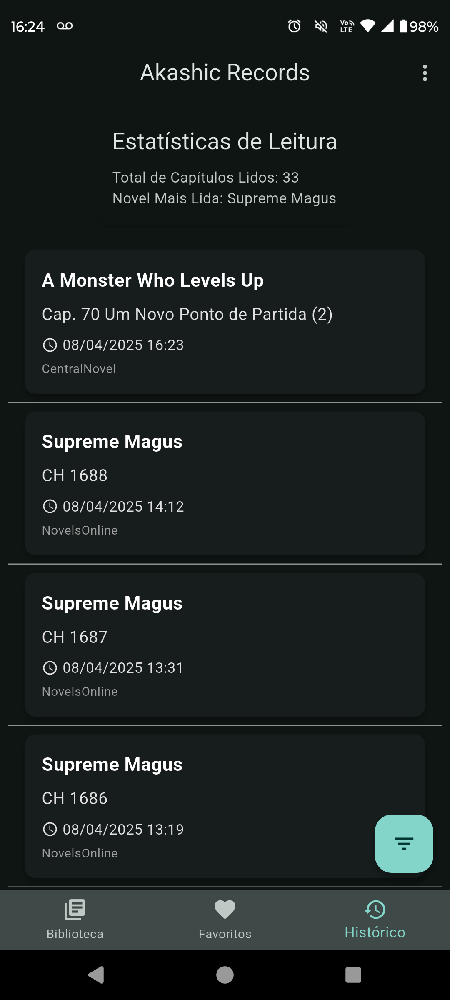
    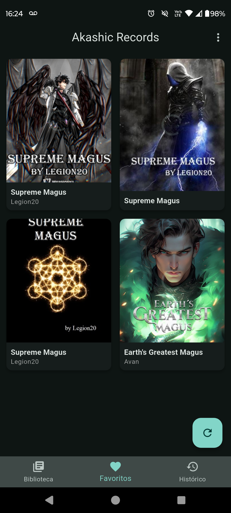
     
    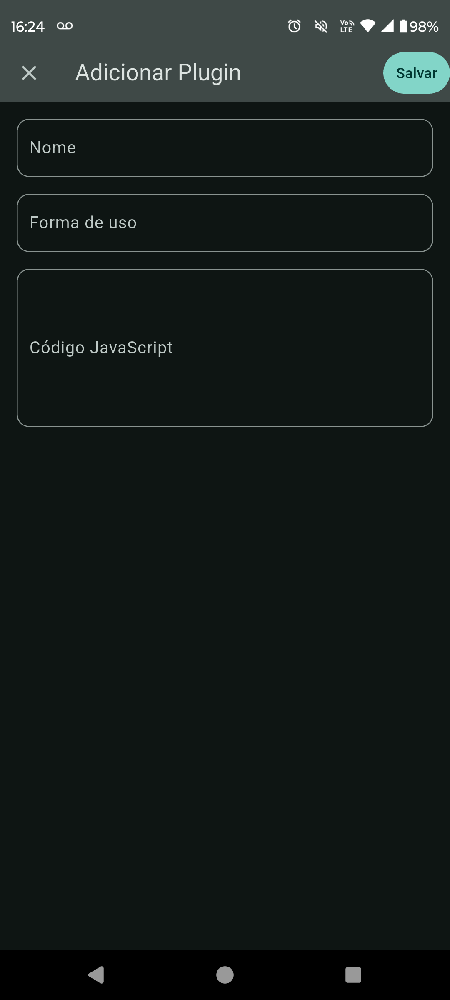
    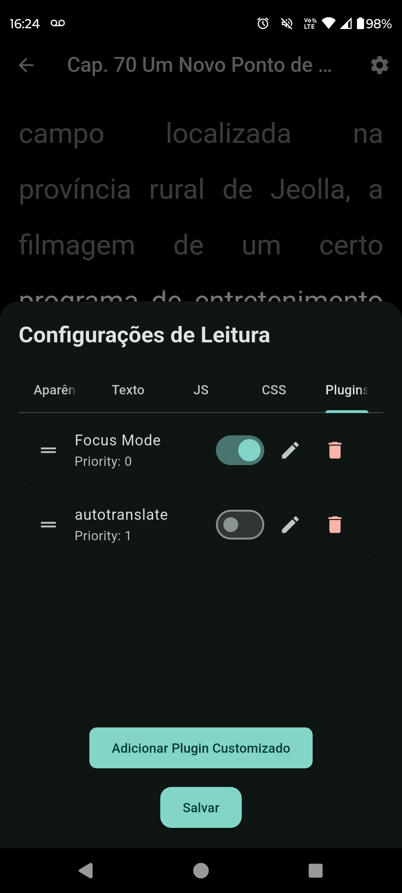
    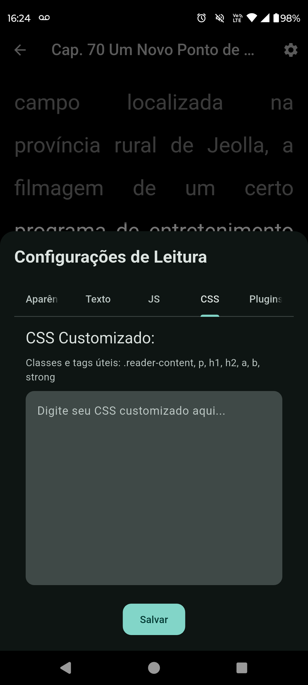
     
    
    
    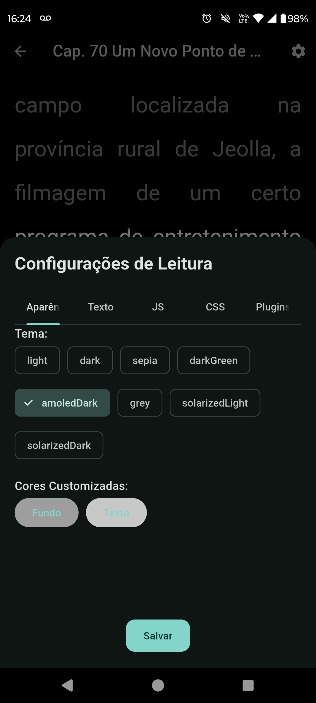
     
    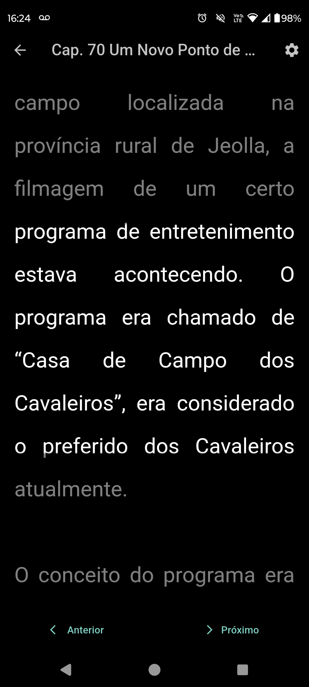
    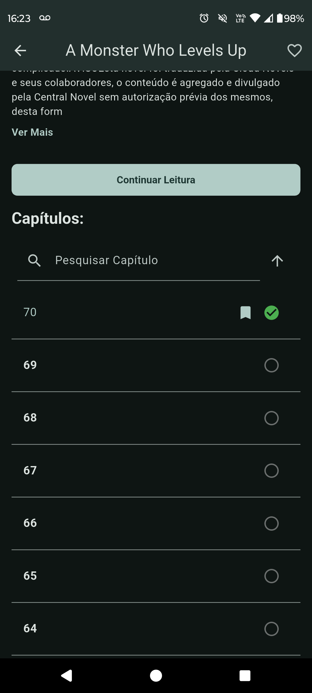
    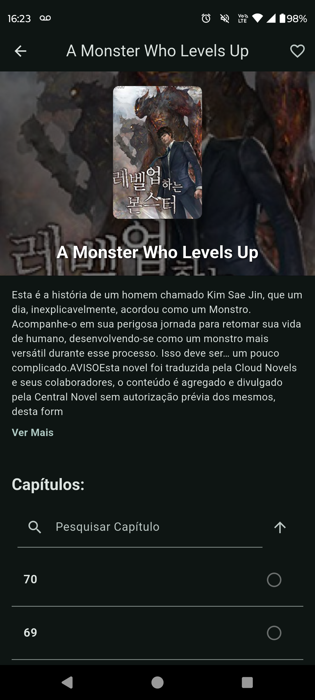
     
    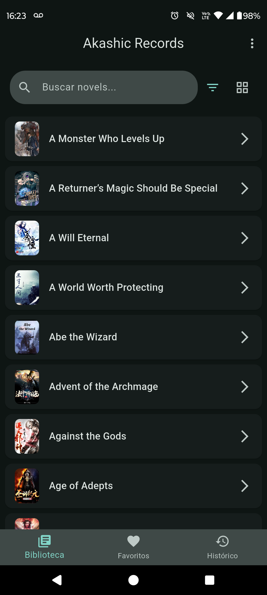
    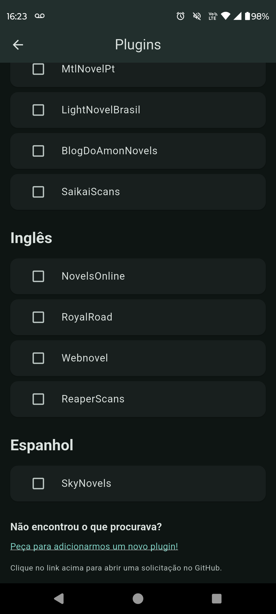
    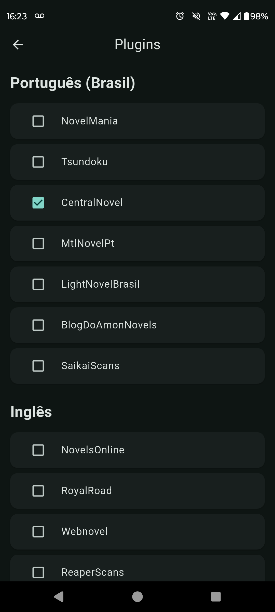
     
    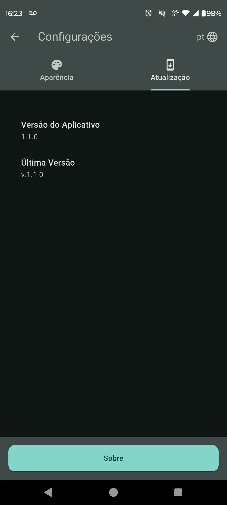
    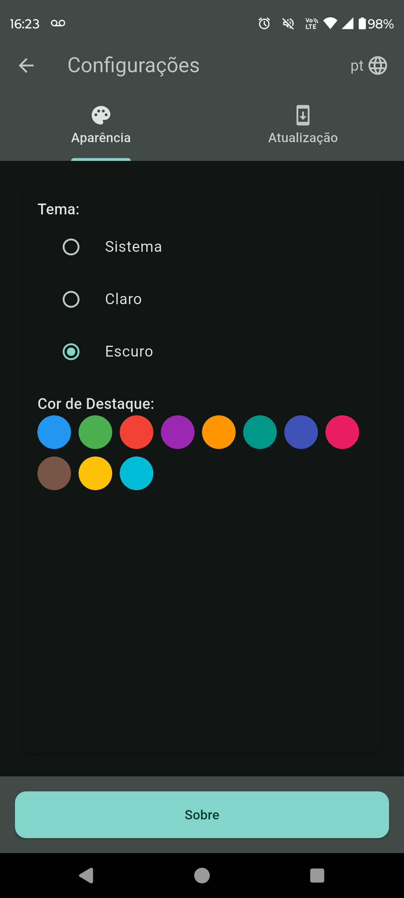
    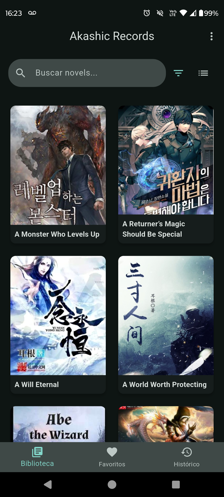

---

## 📚 The Meaning Behind the Name

The term **"Akashic Records"** originates from theosophy and mysticism, referring to a universal archive of knowledge, emotions, and events. This concept aligns with our goal of providing a dynamic and personalized information hub for readers, wherever they are.

---

## 🧰 Tech Stack

- **Flutter** – Cross-platform framework for building mobile and desktop apps
- **Dart** – Core language for Flutter development
- **SQLite** – Local data storage engine
- **Provider** – State management solution for Flutter

---

## 🤝 Contributing

We welcome all contributions! Whether you're fixing bugs, adding new features, or improving documentation—your help is appreciated.

👉 Check out our [Contribution Guidelines](Contribution.md)

---

## 🔗 Links

- **Repository:** [github.com/AkashicRecordsApp/akashic_records](https://github.com/AkashicRecordsApp/akashic_records)
- **Discord Community:** [discord.gg/eSuc2znz5V](https://discord.gg/eSuc2znz5V)

---

## Stargazers over time

## 📌 Topics

`android` `app` `novels` `novelreader`
